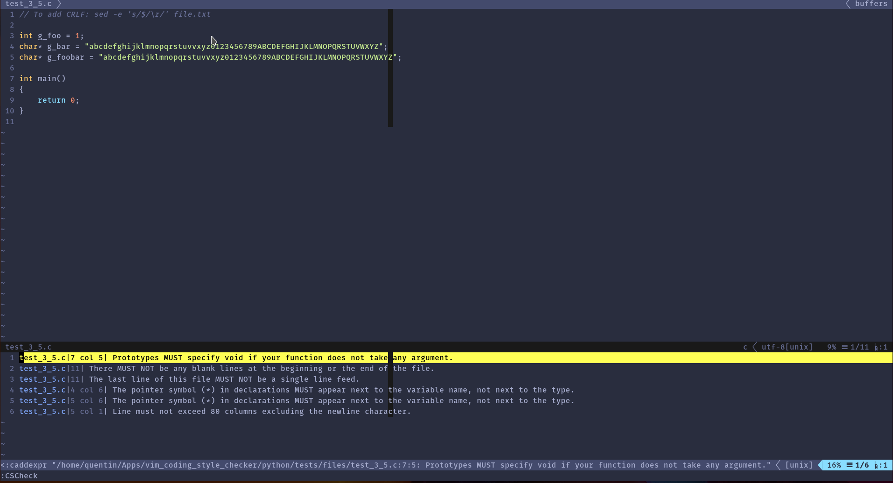

# EpiStyle

[EpiStyle](https://github.com/gastbob40/epistyle/) is a VIM plugin to check that our C code respects different agreements.

This plugin is based on a list of files, each file checking a very precise rule.

EpiStyle is a project by [gastbob40](https://github.com/gastbob40) with contributions from [Baptman21](https://github.com/bat021).

To get started, visit [this page](start.md).

!> We do not in any way provide the rules to respect the coding style of EPITA.

## Example

An example of output is :

